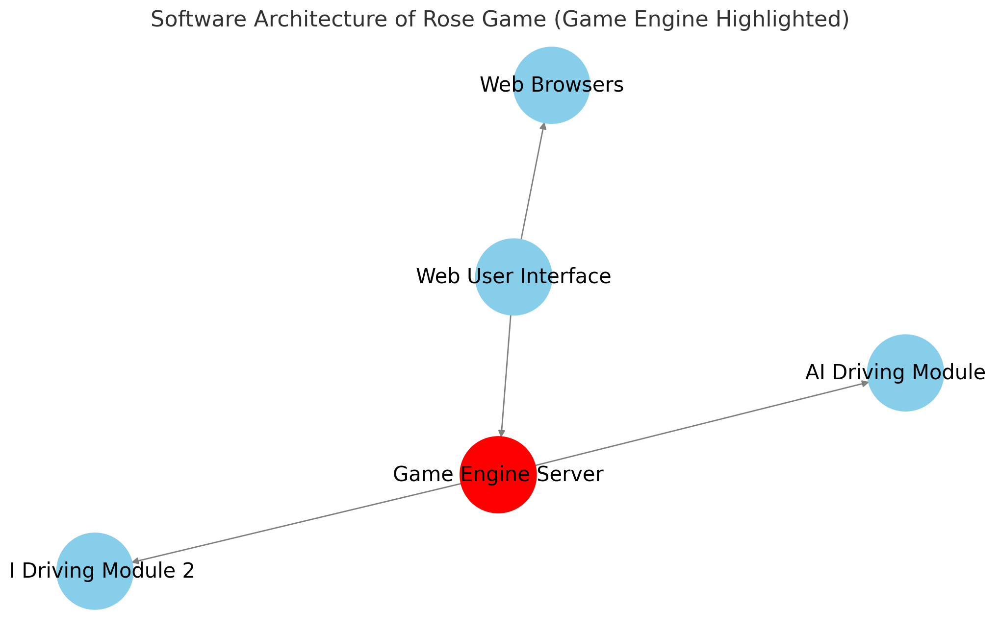

# rose-game-engine
[ROSE game](https://github.com/RedHat-Israel/ROSE) game engine.

This component implement the ROSE game logic, and road simulation.

<p align="center">
  
</p>

ROSE project: https://github.com/RedHat-Israel/ROSE

## Requirements

 Requires | Version | |
----------|---------| ---- |
 Podman (or Docker) | >= 4.8 | For running containerized |
 PYthon   | >= 3.9  | For running the code loally |

## ROSE game components

Component | Reference |
----------|-----------|
Game engine | https://github.com/RedHat-Israel/rose-game-engine |
Game web based user interface | https://github.com/RedHat-Israel/rose-game-web-ui |
Self driving car module | https://github.com/RedHat-Israel/rose-game-ai |

## Running the game engine locally

Clone this repository.

Run the engine locally:

```bash
# Install requirements
pip install -r requirements.txt
pip install -r requirements-dev.txt

# Run the game engine server
make run
```

## Running ROSE game on kubernetes cluster

Log into your cluster, and apply the game inventory.
The game user interface will be avaliable on `NodePort` service `rose/rose-game-web-ui`


```bash
# Apply the game inventory
kubectl apply -f https://raw.githubusercontent.com/RedHat-Israel/rose-game-engine/main/rose-game.yaml

# Get the user interface node port
kubectl get svc -n rose rose-game-web-ui

# Car driving modules will be available using internal service URL
# module intrenal URL example: http://rose-game-ai-reference.rose.svc.cluster.local:8081
```

## Running ROSE game components containerized

### Running the game engine ( on http://127.0.0.1:8880 )

``` bash
podman run --rm --network host -it quay.io/rose/rose-game-engine:latest
```

### Running the game web based user interface ( on http://127.0.0.1:8080 )

``` bash
podman run --rm --network host -it quay.io/rose/rose-game-web-ui:latest
```

### Running your self driving module, requires a local `driver.py` file with your driving module. ( on http://127.0.0.1:8081 )

``` bash
# NOTE: will mount mydriver.py from local directory into the container file system
podman run --rm --network host -it \
  -v $(pwd)/mydriver.py:/mydriver.py:z \
  -e DRIVER /mydriver.py \
  quay.io/rose/rose-game-ai:latest
```
